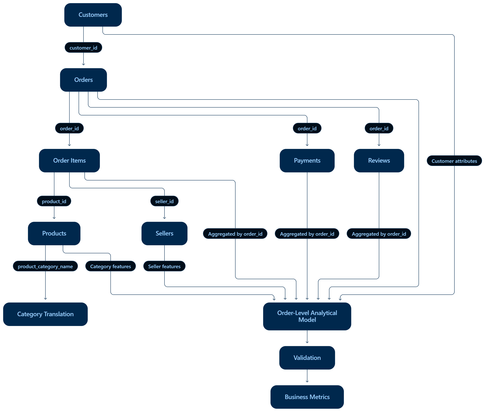

# Olist E-commerce Delivery Performance and Fulfillment Delay Analysis

## 1. Project Overview
This project transforms a one-time exploratory analysis of the Olist e-commerce dataset into a repeatable, dependable data pipeline. The pipeline ingests raw operational data, validates constraints, cleans safely, transforms into an order-level model, and publishes business metrics.

## 2. Business Problem
Understand where delivery delays occur in the e-commerce fulfillment workflow and produce trustworthy operational delivery metrics from fragmented operational databases (orders, items, payments, customers, sellers, products, reviews).

## 3. Stakeholders
- Logistics / Operations Managers
- E-commerce Strategy Leads

## 4. KPI
**Delivery Reliability:**
- Primary KPI: Late Delivery Rate (% of validated delivered orders arriving after the estimated delivery date).
- Secondary KPIs: Median delivery variance, median purchase-to-carrier duration, median carrier-to-customer duration.

## 5. Source Systems
Data originates from the Olist platform, representing a realistic fragmented relational database.

## 6. Data Provenance
The project uses the Brazilian Olist e-commerce dataset obtained from Kaggle. The downloaded CSV files are preserved unchanged under data/raw/. The pipeline treats these files as immutable raw inputs and generates staging, validated, processed, and metric outputs separately.

## 7. Source Map

| Source | Grain | Role |
|---|---|---|
| orders | 1 row = 1 order | Core order lifecycle, status, purchase and delivery timestamps |
| order_items | 1 row = 1 item in an order | Products, sellers, item value and freight |
| order_payments | 1 row = 1 payment record | Payment method, amount and installments |
| order_reviews | 1 row = 1 review | Review score and review information |
| customers | 1 row = 1 customer purchase instance | Customer location and attributes |
| sellers | 1 row = 1 seller | Seller identity and location |
| products | 1 row = 1 product | Product/category attributes |
| category_translation | 1 row = 1 category translation | Portuguese-to-English category mapping |

## 8. Data Model


## 9. Business Workflow


## 10. Data Grains
The pipeline explicitly aggregates child tables (items, payments, reviews) to the **Order Grain** (1 row = 1 unique order) before joining, preventing many-to-many explosions.

## 11. Retrieval Modes
- **CSV/File Retrieval**: Used as the primary pipeline ingestion to read the preserved raw source files.
- **SQL Retrieval**: A lightweight SQLite staging layer is used to perform relational aggregation on the order-item data. SQL-derived order-level features are then materially integrated into the downstream analytical dataset.

## 12. Validation Rules
- **Schema**: Assert presence of required tables and columns for orders, items, and payments. (Critical)
- **Uniqueness**: Assert `order_id` is unique. (Warning - pipeline deduplicates per defined rule)
- **Chronology**: Delivery dates must logically follow purchase and carrier handoff. Invalid records are retained but flagged, and excluded from timing KPIs.
- **Referential Integrity**: Checks that items and payments belong to existing orders.
- **Freshness / Source Coverage**: For this static historical dataset, verifies that the maximum purchase timestamp reaches the expected historical coverage period, helping detect truncated or unexpectedly stale source extracts.

## 13. Known Issues
- Missing delivery and carrier timestamps for some delivered orders.
- Chronology violations (e.g., carrier handoff before purchase).
- Heavy right-tail (extreme positive durations).

## 14. Assumptions
- Seller-level analyses include sellers with at least 10 delivered orders; this threshold is configurable through `seller_min_orders`.
- Extreme positive delivery durations are assumed valid unless they violate basic chronology.

## 15. Limitations
- We establish an *association* between longer carrier-to-customer times and late deliveries, not a causal attribution.

## 16. Repository Structure
```
project/
├── config/
│   ├── config.yaml
│   └── .env.example
├── data/
│   ├── raw/
│   ├── staging/
│   └── processed/
├── logs/
├── notebooks/
│   └── 01_exploration.ipynb
├── src/
│   ├── __init__.py
│   ├── config.py
│   ├── logging_config.py
│   ├── ingest.py
│   ├── retrieve.py
│   ├── validate.py
│   ├── clean.py
│   ├── transform.py
│   ├── metrics.py
│   ├── publish.py
│   └── pipeline.py
├── README.md
├── requirements.txt
└── run_pipeline.py
```

## 17. Configuration
Centralized in `config/config.yaml`. Supports environment overrides (e.g. `LOG_LEVEL`, `SELLER_MIN_ORDERS`) as shown in `config/.env.example`.

## 18. Installation
```bash
python -m pip install -r requirements.txt
```

## 19. How to Run
Run the orchestration script with a specified run date:
```bash
python run_pipeline.py --run-date 2026-09-24
```

## 20. Expected Outputs
- `data/processed/run_date=YYYY-MM-DD/order_features.csv`
- `data/processed/run_date=YYYY-MM-DD/metrics.json`
- `data/processed/run_date=YYYY-MM-DD/validation_report.json`

## 21. Logging
Logs are emitted to stdout and written to `logs/pipeline_YYYY-MM-DD.log`.

## 22. Idempotency
The pipeline uses logical run partitions (`data/processed/run_date=YYYY-MM-DD/`). Running the command multiple times atomically replaces the partition.

## 23. Failure/Chaos Demos
- `--chaos missing_column`: Triggers critical schema validation failure. Stops pipeline.
- `--chaos duplicate_order`: Triggers uniqueness warning. Pipeline proceeds after deduplication.
- `--chaos stale_data`: Creates artificial stale data. Triggers freshness validation failure. Stops pipeline.

## 24. Metric Definitions
See `metrics.json` output for precise definitions. Primarily:
- **Late delivery rate**: % of valid delivered orders late.
- **Median delivery variance**: Actual - Estimated delivery.
- **Late delivery rate (Threshold Sellers)**: Late rate only for orders involving sellers who met the `seller_min_orders` configuration threshold.

## 25. Key Business Findings
- Late deliveries are associated with longer carrier-to-customer durations.
- Seller delivery volume is heavily skewed.

## 26. How the Pipeline Supports the Decision
By structuring the pipeline into Extract → Validate → Clean → Transform → Metrics, business stakeholders receive reproducible and traceable outputs. Exclusions (e.g., chronological violations) are handled reproducibly, raw data is preserved, and execution is logged and validated.


## 27. Evidence Table

| Metric | Definition | Value | Population | Known | Unknown | Assumption | Limitation |
|---|---|---:|---:|---|---|---|---|
| Late Delivery Rate | % of valid delivered orders arriving after the estimated delivery date | 8.12% | 96,281 | Actual and estimated delivery timestamps | Exact cause of each delay | Invalid lifecycle timestamps are excluded from the KPI population | Depends on the accuracy of the estimated delivery date |
| Median Delivery Variance | Median days between actual and estimated delivery | -11.93 days | 96,281 | Actual and estimated delivery timestamps | Why individual orders differ from estimates | Negative means delivery occurred before the estimate | Sensitive to how the valid KPI population is defined |
| Median Purchase → Carrier | Median days from purchase to carrier handoff | 2.20 days | 96,281 | Purchase and carrier timestamps | Reason for seller/processing delays | Only chronologically valid timestamps are included | Extreme positive durations create a long right tail |
| Median Carrier → Customer | Median days from carrier handoff to customer delivery | 7.10 days | 96,281 | Carrier and customer delivery timestamps | Exact cause of carrier-to-customer delays | Only chronologically valid timestamps are included | Shows association with delivery performance, not causation |

KPI metrics are calculated only on delivered orders with complete required timestamps and a chronologically valid fulfillment sequence. Raw records excluded by these validation rules are retained and reported rather than deleted.

[Detailed Evidence Table](docs/evidence_table.md)

## 28. Decision Supported

The output supports operational investigation of delivery performance by showing the overall late-delivery rate and separating the fulfillment process into purchase-to-carrier and carrier-to-customer stages.

The analysis can help identify where further operational investigation should be focused. It does not determine the causal reason for an individual delay.

## 29. Dashboard

A lightweight business-facing dashboard presents the final delivery-performance metrics and validation findings produced by the pipeline.

[View the live dashboard](https://kavyadhyani.github.io/Olist-Delivery-Pipeline/)
